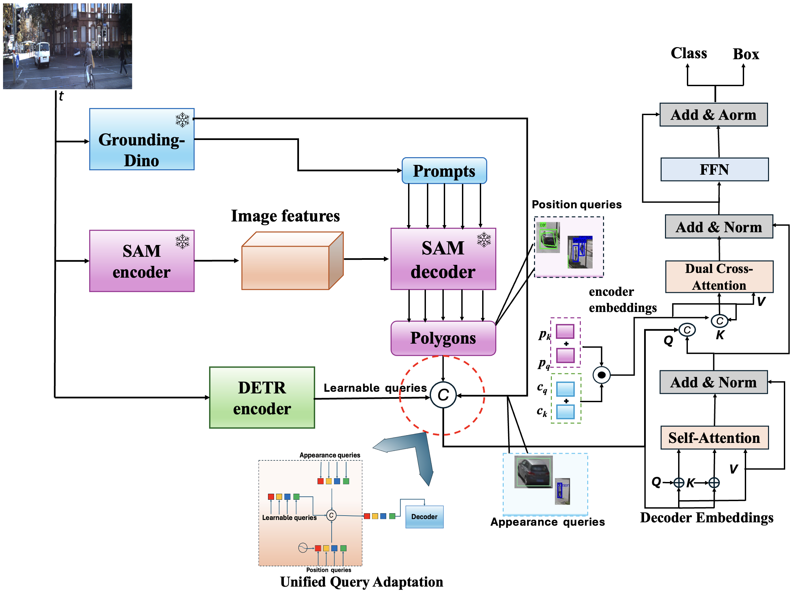
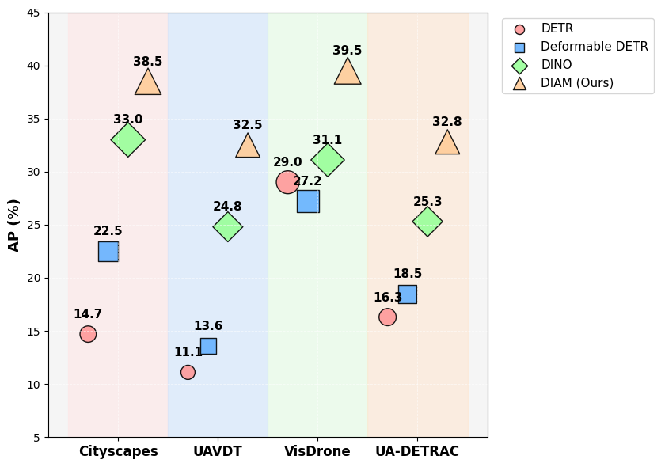

<h1 align="center"> DAMM: Dual-Stream Attention with Multi-Modal Queries for Unified
Semantics-Geometry Object Detection </h1>

<h2 align="center">

</h2>

This repository contains the implementation of the following paper:
> **DAMM: Dual-Stream Attention with Multi-Modal Queries for Unified
Semantics-Geometry Object Detection**<br>
## Abstract:

Transformer-based object detectors often struggle with occlusions, fine-grained localization, and computational inefficiency caused by fixed queries and dense attention. We propose DAMM, Dual-stream Attention with Multi-Modal queries, a novel framework introducing both query adaptation and structured cross-attention for improved accuracy and efficiency. DAMM capitalizes on three types of queries: appearance-based queries from vision-language models, positional queries using polygonal embeddings, and random queries for broader scene coverage. A \textbf{dual-stream cross-attention} module separately refines semantic and spatial features, boosting localization precision in cluttered scenes. We evaluate DAMM on four challenging benchmarks: Cityscapes, UAVDT, VisDrone, and UA-DETRAC, achieving state-of-the-art performance in average precision (AP) and recall. Our results underscore the effectiveness of multi-modal query adaptation and dual-stream attention in advancing transformer-based object detection.
> 

  
<p align="center">
  
</p>


## Comparison between Baseline and DAMM:
<p align="center">
  
</p>


## Installation

### Requirements
- Python >= 3.7, CUDA >= 10.1
- PyTorch >= 1.7.0, torchvision >= 0.6.1
- Cython, COCOAPI, scipy, termcolor

The code is developed using Python 3.8 with PyTorch 1.7.0.
First, clone the repository locally:
```shell
git clone https://github.com/Atten4Vis/ConditionalDETR.git
```
Then, install PyTorch and torchvision:
```shell
conda install pytorch=1.7.0 torchvision=0.6.1 cudatoolkit=10.1 -c pytorch
```
Install other requirements:
```shell
cd DAMM
pip install -r requirements.txt
```


## Usage

### Data preparation

Download and extract COCO 2017 train and val images with annotations from
[http://cocodataset.org](http://cocodataset.org/#download).
We expect the directory structure to be the following:
```
path/to/coco/
├── annotations/  # annotation json files
└── images/
    ├── train2017/    # train images
    ├── val2017/      # val images
    └── test2017/     # test images
```

## Object Detection Results on Cityscapes Validation Set
_Best in **bold**, second best in _underlined_._

| **Group**   | **Method**                                      | **AP**  | **AP50** | **AP75** | **APS**  | **APM**  | **APL**  |
|------------|-------------------------------------------------|--------|--------|--------|--------|--------|--------|
| **Baseline** | DETR* [Zhang et al.](https://arxiv.org/abs/2203.16507) | 14.7   | 26.5   | 11.3   | 4.6    | 11.2   | 28.6   |
|            | Conditional DETR [Wang et al.](https://arxiv.org/abs/2106.02537) | 21.1   | 42.7   | 18.8   | 3.6    | 19.8   | 41.1   |
|            | Deformable DETR* [Zhu et al.](https://arxiv.org/abs/2010.04159) | 22.5   | 41.7   | 22.5   | 7.9    | 20.7   | 42.1   |
|            | DN-DETR* [Li et al.](https://arxiv.org/abs/2203.03086) | 26.0   | 46.0   | 23.0   | 7.0    | 25.0   | 43.0   |
|            | DAB-Deformable DETR* [Liu et al.](https://arxiv.org/abs/2203.03605) | 27.3   | 48.0   | 24.5   | 8.2    | 26.1   | _45.3_  |
|            | OV-DETR [Zang et al.](https://arxiv.org/abs/2203.15332) | 31.5   | 54.3   | 36.2   | 11.1   | 34.5   | 56.1   |
|            | DINO-Deformable DETR* [Zhang et al.](https://arxiv.org/abs/2203.03605) | 33.0   | 56.0   | 38.0   | 11.5   | 35.0   | 57.0   |
|            | _Grounding DINO_ [Liu et al.](https://arxiv.org/abs/2303.09852) | _35.5_ | _58.7_ | _39.6_ | _13.9_ | _37.5_ | _59.4_ |
| **Other SOTA** | YOLOS-S [Wang et al.](https://arxiv.org/abs/2106.00666) | 9.8    | 25.3   | 6.1    | 1.9    | 8.1    | 20.7   |
|            | UP-DETR [Dai et al.](https://arxiv.org/abs/2012.10972) | 23.8   | 45.7   | 20.8   | 4.0    | 20.3   | 46.6   |
|            | DELA-DETR [Wang et al.](https://arxiv.org/abs/2203.12089) | 25.2   | 46.8   | 22.8   | 6.5    | 23.8   | 44.3   |
|            | FP-DETR [Wang et al.](https://arxiv.org/abs/2106.02537) | 29.6   | 53.6   | 28.4   | 11.2   | 30.9   | 47.4   |
|            | ViLD [Gu et al.](https://arxiv.org/abs/2111.02288) | 29.7   | 54.3   | 52.5   | --     | --     | --     |
|            | OWL-ViT* [Minderer et al.](https://arxiv.org/abs/2205.06230) | 30.0   | 53.0   | 33.0   | 10.0   | 32.0   | 54.0   |
|            | DenseCL [Wang et al.](https://arxiv.org/abs/2011.09157) | 30.1   | 53.5   | 35.7   | 11.8   | 32.6   | 55.2   |
| **Ours**   | **DAMM** | **38.5** | **62.5** | **47.5** | **16.1** | **41.5** | **65.7** |

\* Methods fine-tuned in our setup.


### Training

To train DAMM on a single node with 8 gpus for 50 epochs run:
## License

DAMM is released under the Apache 2.0 license. Please see the [LICENSE](LICENSE) file for more information.


## Citation


